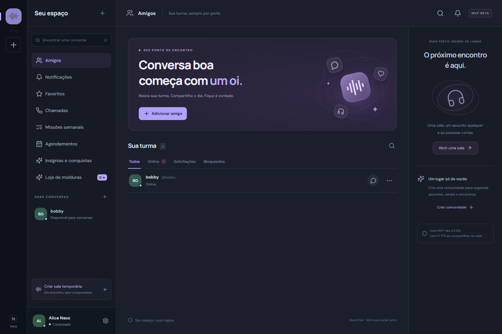
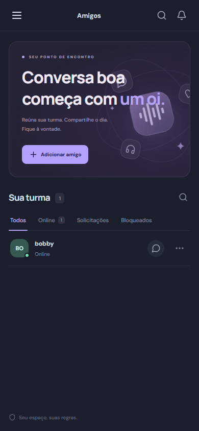

# Validação executada

## Atualização 0.5

Build e verificação TypeScript passaram. As duas suítes de integração passaram: recursos anteriores e novos fluxos de enquetes (voto único concorrente, retirada, encerramento), eventos/presença, favoritos privados, fixados, mídia da comunidade, denúncia e resolução, modo lento, duplicação de mensagem, timeout e preferências visuais.

Os testes de canais privados verificaram listagem, mensagens, anexos, favoritos e chamada após retirar o cargo. Migrations foram reaplicadas preservando dados. O limite de mídia é protegido por transação; limites de leitura e escrita por usuário foram separados do limite geral por IP para permitir atualização simultânea da interface sem remover a proteção de envio.

Os dois testes de navegador passaram. Foram exercitados os fluxos anteriores de chamada, microfone ausente, câmera/tela e PC + celular; teste local de microfone e destaque de transmissão; enquetes com duas contas, voto e encerramento; favoritos/fixados; evento com confirmação de presença; upload e envio de emoji/figurinha; configuração de canal privado/modo lento; salvamento do tema e banner; desktop e viewport de 390 px sem overflow horizontal.

Foram corrigidos durante a validação: abas comprimidas no painel, nomes acessíveis dos seletores, abertura do seletor antes de carregar os itens e o limite de requisições que contava atualizações automáticas como uso excessivo. Banco de teste PGlite descartável; mídia simulada com transporte WebRTC real. PostgreSQL dedicado, celular físico, Safari/iOS, TURN e publicação no Railway não foram validados nesta rodada.

## Atualização 0.4

Build TypeScript/Vite e integração passaram. Foram verificados resgate concorrente da mesma conquista (um crédito apenas), rejeição de requisito incompleto, seleção de insígnia desconhecida/não conquistada, IDs repetidos, limite de três, ordem de exibição, persistência após reaplicar migrations, vitrine pública e preservação da coleção após ocultar insígnias.

O teste de navegador também passou: resgatar Primeiro Nexo, creditar Faíscas, exibir no perfil, verificar estado salvo e renderizar a página no desktop e em largura de 390 px sem overflow horizontal. Os fluxos anteriores de loja, perfil, mensagens e chamadas foram executados novamente. Mídia física e redes externas continuam fora da validação automatizada.

## Atualização 0.3

Build e testes de integração passaram. O teste de navegador passou com duas contas e um terceiro dispositivo na mesma conta. Foram verificados: convite recebido e aceito antes de abrir o microfone; recusa/cancelamento e histórico via API; rejeição de resposta por terceiro; resgate diário simultâneo com apenas um crédito; compra simultânea com apenas um débito; rejeição de preço forjado e moldura não adquirida; reaplicação da migration sem perder a carteira; compra/equipamento pela interface e ausência de overflow no celular; habilitação explícita de áudio entre dispositivos da mesma conta.

Os fluxos anteriores de mensagens, perfis, mídia WebRTC, câmera e tela simultâneas, ausência de microfone e saída independente também passaram. Microfone/câmera continuam simulados e a tela usa canvas sintético, com transporte WebRTC real. O teste não confirma o alto-falante/microfone do celular físico do usuário, Safari/iOS, TURN ou chamadas com o navegador fechado.

## Atualização 0.2 — resultado final

`npm run build` e `npm test` passaram após a atualização. `node tests/browser.mjs` passou com duas contas e um terceiro contexto de navegador usando a mesma conta, em viewport de celular.

Cobertura nova:

- Migration 002 aplicada e reaplicada sem apagar usuários; campos de perfil persistidos.
- Validação de cor e limites de texto; rejeição de banner pertencente a outra conta; autorização e remoção de imagem pública.
- Prévia e salvamento de nome, bio, pronomes, status, cor, avatar e banner; interface desktop e mobile sem overflow horizontal.
- Áudio e vídeo WebRTC recebidos e decodificados; câmera e tela simultâneas; parar e reiniciar a tela sem interromper a câmera, e vice-versa.
- `NotFoundError` e `NotAllowedError` no microfone mantêm a pessoa como ouvinte; recebimento de áudio sem microfone; ativação tardia do microfone durante a mesma conexão.
- Cancelar o seletor de tela mantém a chamada; todas as tracks capturadas são encerradas ao sair.
- Modos Só ouvir e PC + celular não chamam getUserMedia para áudio; duas sessões da mesma conta entram juntas, tela do PC chega ao celular e ao amigo, áudio da própria conta é silenciado e sair do PC preserva as outras sessões.
- Estado de mídia validado pelo servidor, identidade obtida da sessão e eventos antigos de saída ignorados.

**Limite dos testes de mídia:** microfone/câmera são dispositivos simulados pelo Edge; a captura de tela usa um canvas sintético no lugar do seletor nativo. O transporte e a decodificação são WebRTC reais. Não foram testados um celular físico, áudio de sistema/aba capturado pelo seletor nativo, redes distintas/TURN, Safari/iOS ou TLS do seu Railway. O deploy remoto continua sendo uma etapa do usuário.

Capturas da atualização: [perfil desktop](screenshots/profile-desktop.png), [perfil mobile](screenshots/profile-mobile.png), [entrada na chamada](screenshots/call-lobby.png).

## Registro da versão 0.1

Data: 21/09/2026. Ambiente: Windows, Node.js 24.19.0, Edge headless, banco PostgreSQL embutido PGlite.

## Resultados

- `npm install`: concluído; auditoria reportou zero vulnerabilidades na instalação. Versões resolvidas estão no `package-lock.json`.
- `npm run build`: passou. TypeScript da API e do frontend, e build Vite de produção.
- `npm test`: passou. Uma suíte integrada com dezenas de verificações reais de HTTP, SQL e WebSocket, usando diretório de banco temporário apagado ao concluir.
- `node tests/browser.mjs`: passou. Aplicação compilada executada com duas sessões independentes no Edge, desktop 1440×960 e mobile 390×844.

## Cobertura exercitada

Cadastro, username duplicado, login inválido/válido, logout, revogação de sessão, recusa de mutação sem origem, privacidade inicial de DM, envio/aceite de amizade, DM única para o par, rejeição de terceiro não participante, evento de digitação, envio/resposta/edição/exclusão/reação, confirmação de leitura, upload permitido e rejeição de HTML disfarçado de PNG, autorização de download, grupos, salas temporárias, comunidades, categorias, convite/entrada, restrição de criação de canal, cargo sem envio, atribuição de cargo, banimento, bloqueio/desbloqueio e recusa de sinalização fora da chamada.

No navegador: cadastro pela interface, solicitação/aceite de amizade, abertura de DM, entrega de mensagens nos dois sentidos, chamada com duas conexões WebRTC no estado `connected`, áudio recebido (`bytesReceived > 0`) e vídeo recebido (`framesDecoded > 0`), mute/deafen, abertura de dispositivos, saída de chamada, tela desktop, ausência de overflow horizontal mobile e abertura de configurações no celular.

As chamadas do teste utilizam microfone e câmera simulados pelo navegador, mas o transporte e a decodificação são WebRTC reais. O teste não substitui uma chamada com dispositivos físicos e redes diferentes.

## Limites da validação

PostgreSQL dedicado/Docker não foram executados, pois não estavam instalados neste ambiente. O SQL foi exercitado no PostgreSQL embutido PGlite. Compartilhamento de tela foi implementado, mas o seletor nativo de tela não foi testado automaticamente. Também não foram validados TURN em rede externa, TLS em proxy real, dispositivos físicos, recuperação após falha de disco, carga/escala, Safari/iOS ou push.

## Reproduzir

```powershell
npm install
npm run build
npm test
node tests/browser.mjs
```

O teste de navegador usa o canal `msedge`, porta local 3101 e banco descartável. Para outro navegador instalado compatível, defina `BROWSER_CHANNEL` (por exemplo `chrome`). Ele usa mídia simulada e não acessa a câmera ou o microfone físico. As capturas são gravadas em `docs/screenshots/`.




## Versão 0.6 — validação local

- Compilação TypeScript e Vite concluída.
- Três testes de integração de API: fundação, recursos 0.5 e recursos 0.6. O teste 0.6 cobre TOTP e rejeição de reutilização, códigos de recuperação consumidos uma vez, revogação de sessões, busca com restrições, tópicos, encerramento, envio agendado único, cancelamento, bloqueio antes do envio, mídia de voz, perfil local, acessibilidade, recompensa semanal única e backup criptografado com restauração de dados/anexos em banco vazio.
- Três cenários de navegador Edge passaram: `browser.mjs`, `community-browser.mjs` e `everyday-browser.mjs`.
- O cenário 0.6 gravou e reproduziu áudio com MediaRecorder, verificou encerramento das faixas do microfone, criou/respondeu tópico, buscou resposta no histórico, agendou/cancelou envio, gerou códigos de recuperação, salvou acessibilidade, abriu convite por link e exibiu apelido por comunidade.
- Capturas desktop e mobile da versão 0.6 inspecionadas; sem transbordamento horizontal na largura de 390 px.
- Os testes de chamadas anteriores passaram novamente com mídia simulada: câmera+tela, PC+celular na mesma conta, listener e ausência de microfone.

Não validado em aparelho físico, Safari ou PostgreSQL externo. Nada foi publicado no Railway por estes testes. A versão permanece sem E2EE.

## Versão 0.6.1

Compilação passou. Quatro testes da API passaram: fundação, recursos 0.6, comunidade com exclusão e configuração RTC. A exclusão foi negada a um membro e a um administrador com todas as permissões; nome incorreto também foi recusado. A exclusão pelo dono removeu dados/anexos vinculados e encerrou a chamada ativa.

Os cenários de navegador de chamadas e comunidade passaram. O teste de chamadas simulou rejeição de autoplay, recuperou a reprodução com Ativar som ao sair de ensurdecido e verificou que o elemento de áudio ficou em reprodução e desmutado. Os fluxos de PC + celular e compartilhamento de tela continuaram passando. O teste da comunidade confirmou o nome e aguardou a comunidade desaparecer da lista.

Isso não comprova a resolução no celular físico do usuário nem valida um serviço TURN externo. O aplicativo agora fornece indicadores para distinguir transporte, reprodução e modos de silêncio. Nenhuma configuração do Railway foi alterada.

## Versão 0.6.2 — instalação

Compilação TypeScript/Vite e teste dedicado `npm run test:install` passaram. O teste conferiu o manifesto pelo navegador, dimensões dos ícones PNG, prompt de instalação simulado consumido uma vez, cancelamento, evento de instalação, instruções iPhone, ausência de transbordamento em 390 px e tela offline. O cache do service worker contém somente offline.html e offline.css; a API não é oferecida offline. A instalação nativa no sistema operacional e aparelhos físicos não foi automatizada. Nenhum deploy foi realizado.

## Versão 0.7 — comunidades e personalização

Compilação TypeScript/Vite passou. Os quatro testes anteriores da API passaram com a migração 007; o teste adicional 0.7 passou com identidade/imagens, regras versionadas, autorização, transferência/saída, cargos comuns e desbloqueados por conquista, fórum/filtros/respostas, notificações, compras e presentes, preferência individual de volume, enquetes/lembretes e backups novos/antigos.

O teste adicional enviou dois pedidos de presente concorrentes: apenas uma entrega e um desconto. Também verificou recusa de presente repetido, de não amigo e após bloqueio, equipamento na categoria correta, ausência de permissão para assumir o dono e conservação das imagens quando o novo dono altera a bio. O lembrete foi processado duas vezes sem duplicar a notificação. Backups 0.7 foram restaurados com os novos dados; conteúdo no formato 0.6 foi aceito com o catálogo novo preservado.

Três cenários de navegador Edge passaram nesta rodada:
- `browser.mjs`: fluxos existentes de conta/perfil/loja/insígnias e WebRTC com dispositivos simulados, teste de alto-falante, qualidade estimada e volume 37 persistido após sair e reentrar.
- `community-browser.mjs`: enquetes, eventos/RSVP, imagens da comunidade, permissões, moderação e exclusão pelo dono.
- `community-plus-browser.mjs`: edição de identidade com uploads, regras e escolha de cargo, fórum com respostas entre duas contas, notificações, enquete/lembrete/RSVP, compra de presente e equipamento persistido, transferência aceita e saída do antigo dono.

Capturas de fórum desktop/mobile e eventos foram inspecionadas. Sem transbordamento horizontal no viewport mobile de 390 px. Os novos testes usam contas e banco descartáveis.

Limites: não houve publicação no GitHub/Railway nesta rodada nem validação em celular físico, Safari, PostgreSQL dedicado ou servidor TURN externo. Os testes WebRTC locais comprovam o fluxo entre navegadores com mídia simulada, não o alto-falante do aparelho do usuário. E2EE e push continuam ausentes.
